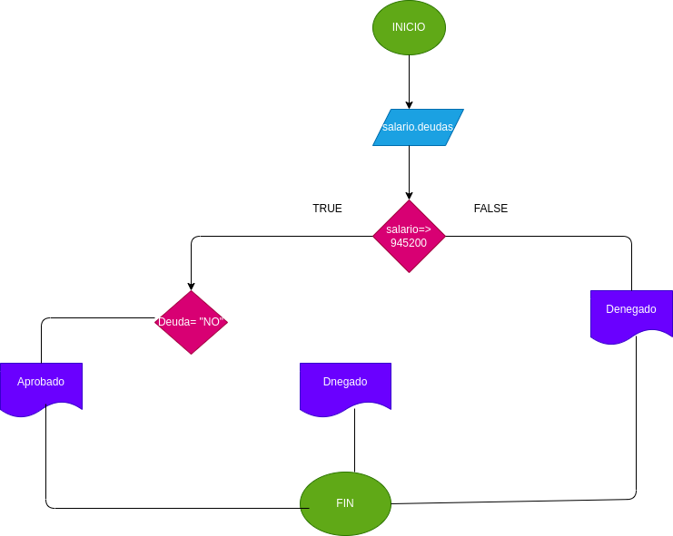

# ESTRUCTURAS-CONDICIONALES

Programa aprobar un prestamo bancario dependiendodl historial crediticio y salario actual de la persona

# ANALISIS

Variables de entrada y proceso (entrada,procesamiento)

Salario, Deuda:Cosas necesarias para verificar un prestamo

Varibales de salida

Salario
Deuda
Salario=<945200
Deuda="No"
Aprobada
Rechazada

Verifica si una person es apta para un prestamo bancario

# DISEÑO

# CONSTRUCCION