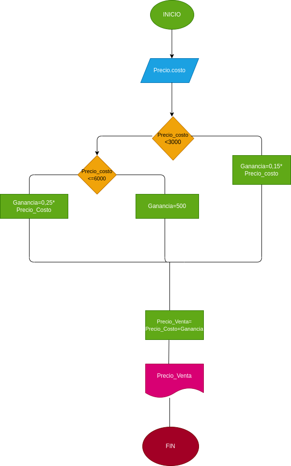

# Estructuras-condicionales
# Estructuras-condicionales
Programa que calcula el porcentaje de ganancia de ciertos productos dependiendo su valor
# ANALISIS

Variables de entrada y proceso (input, processing)

Precio_costo: Necesario para sacar el porcentaje de los productos

Variables de salida

Precio_costo<3000
Precio_costo<
Ganancia=0,15*Precio_costo
Ganacia=0,25*Precio_costo
Ganancia=500
Precio_venta=Precio_costo+Ganancia

Nos indicara cual es ell valor final de los productos  

# DISEÑO

# CONSTRUCCION